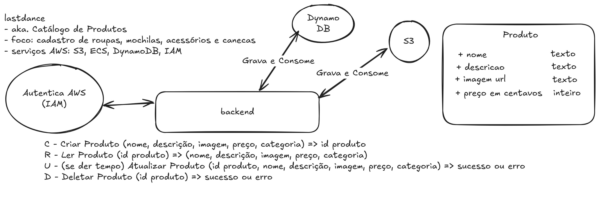

# TechFinance LastDance API

## Descrição

A TechFinance LastDance API é uma aplicação backend desenvolvida em TypeScript que utiliza o framework Hono para gerenciar rotas e validações. A API é integrada com AWS DynamoDB e S3 para armazenamento de dados e arquivos, respectivamente. O projeto também suporta execução local utilizando o LocalStack.



## Funcionalidades

- **Gerenciamento de Produtos**:
  - Listar produtos
  - Criar produtos
  - Obter detalhes de um produto
  - Deletar produtos
- **Upload de Imagens**:
  - Upload de imagens para o S3

## Tecnologias Utilizadas

- **Linguagem**: TypeScript
- **Framework**: Hono
- **Banco de Dados**: DynamoDB
- **Armazenamento de Arquivos**: S3
- **Validação de Dados**: Zod
- **Execução Local**: LocalStack

## Estrutura do Projeto

```
techfinance-lastdance-api/
├── docker-compose.yaml
├── Dockerfile
├── init-localstack.sh
├── package.json
├── pnpm-lock.yaml
├── tsconfig.json
├── src/
│   ├── app.ts
│   ├── server.ts
│   ├── config/
│   │   └── env.ts
│   ├── models/
│   │   └── Product.ts
│   ├── routes/
│   │   └── products.ts
│   ├── schemas/
│   │   └── create-product.schema.ts
│   ├── services/
│   │   ├── dynamodb.ts
│   │   └── s3.ts
│   └── utils/
│       └── aws.ts
```

## Configuração e Execução

### Pré-requisitos

- Node.js 22+
- Docker e Docker Compose
- pnpm (gerenciador de pacotes)

### Passos para Configuração

1. Clone o repositório:
   ```bash
   techfinance-git clone https://github.com/gabrielalmir/techfinance-lastdance-api
   techfinance-cd lastdance-api
   ```

2. Instale as dependências:
   ```bash
   pnpm install
   ```

3. Configure o arquivo `.env` com as variáveis de ambiente necessárias:
   ```env
   AWS_REGION=us-east-1
   BUCKET_NAME=nome-do-bucket-aqui-por-favor-digite-algo
   IS_OFFLINE=true
   ```

4. Inicie os serviços com Docker Compose:
   ```bash
   docker-compose up
   ```

5. Inicialize os recursos no LocalStack:
   ```bash
   ./init-localstack.sh
   ```

6. Acesse a API em: [http://localhost:8080](http://localhost:8080)

## Endpoints

### Produtos

- **GET** `/produtos` - Lista todos os produtos.
- **GET** `/produtos/:id` - Retorna os detalhes de um produto específico.
- **POST** `/produtos` - Cria um novo produto (requer envio de imagem).
- **DELETE** `/produtos/:id` - Deleta um produto específico.
